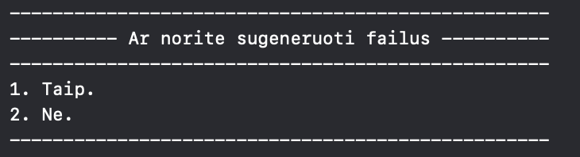
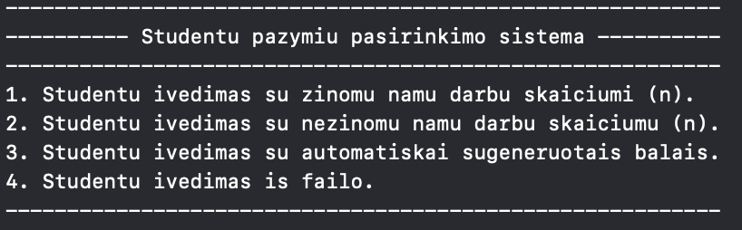
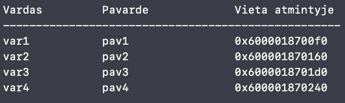
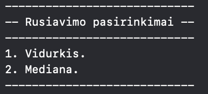
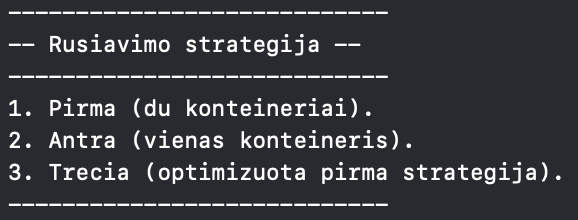
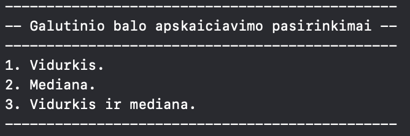
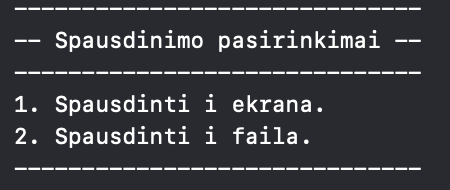
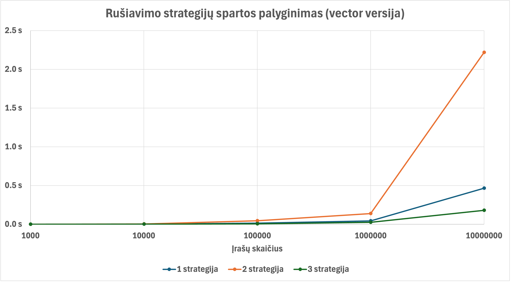
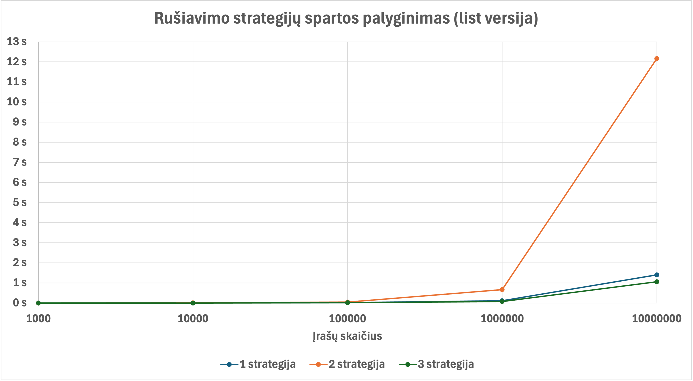

# Studentų galutinio įvertinimo skaičiavimo programa
## Programos tikslas
Apskaičiuoti pateiktų studentų galutinį įvertinimą, pagal nurodytą formulę:
### galutinis = 0.4 * vidurkis/mediana + 0.6 * egzaminas

## Programos versijos
### Versija 0.1:
- Programa leidžia įvesti studentų duomenis rankiniu būdu arba atsitiktinai sugeneruoti jų balus, taip pat juos nuskaityti iš failo.
- Galima pasirinkti, kaip bus pateikiamas galutinis balas: vidurkis, mediana arba abu variantai.
- Rezultatus galima surikiuoti pagal studentų vardus arba pavardes.

### Versija 0.2 – patobulinta 0.1 versija:
- Pridėta galimybė generuoti studentų duomenų failus.
- Studentus galima suskirstyti į dvi grupes pagal galutinį balą.
- Įtrauktas pasirinkimas rikiuoti rezultatus pagal galutinį įvertinimą.

### Versija 0.3 – patobulinta 0.2 versija:
- Pridėta funkcija, kuri atspausdina rankiniu būdu įvestų studentų vietą atmintyje.
- Sukurtos dvi atskiros programos versijos: list ir vector.
-Atlikta konteinerių spartos analizė.

### Versija 1.0 – patobulinta 0.3 versija:
- Pridėtos dvi papildomos studentų rūšiavimo į dvi gropes strategijos.
- Atlikta studentų rūšiavimo spartos analizė.

## Išsamus galutinės versijos veikimo principas

### Vartotojas gali pasirinkti, ar nori generuoti studentų duomenų failus:

<b>Pasirinktus 2 variantą:</b>

Programa sugeneruoja 5 atsitiktinius studentų sąrašų failus, sudarytus iš: 1 000, 10 000, 100 000, 1 000 000, 10 000 000 įrašų.

### Vartotojas gali pasirinkti, kaip įvesti studentų duomenis:

<b>Pasirinkus (1-3) variantus:</b> 

Ekrane yra atspausdinamas kiekvieno studento saugojimo atmintyje adresas.

### Vartotojas gali pasirinkti, pagal kokį kriterijų nori surūšiuoti studentų duomenis į failus vargsiukai.txt ir kietiakai.txt:

<b>Studentai į grupes skirtstomi pagal: </b>
- Studentai, kurių galutinis balas < 5.0 yra “vargšiukai”.
- Studentai, kurių galutinis balas >= 5.0 galėtume yra "kietiakiai".

### Vartotojas gali pasirinkti, kurią rūšiavimo strategiją naudoti:

### Vartotojas gali pasirinkti, pagal kokius kriterijus bus apskaičiuotas ir atspausdintas galutinis įvertinimas:

### Vartotojas gali pasirinkti, ar rezultatus rikiuoti pagal studentų vardus, pavardes ar galutinį rezultatą:

### Vartotojas gali pasirinkti ar duomenis spausdinti į ekraną ar į failus:

### Vartotojas gali pasirinkti, ar nori kad į ekraną atspausdintų visus studentų duomenis:

<b>Programos išvedimo forma:</b>

| Vardas  | Pavardė       | Galutinis (Vid.) | Galutinis (Med.) |
|---------|---------------|-----------------|-----------------|
| Arvydas | Sabonis       | x.xx            | x.xx            |
| Rimas   | Kurtinaitis   | y.yy            | y.yy            |
| ...     | ...           | ...             | ...             |

<b>Programos pabaigoje atspausdinama, kiek laiko (ms) užtruko spartos analizėje testuotos funkcijos.</b>

## Klaidų tikrinimas
- Programa tikrina skaičių įvedimą, neleidžiant įvesti ne skaitmenų. Pvz.: a5, penki.
- Programa tikrina ar vartotojas nieko neįvedė t.y. paspaudė "enter" mygtuką.
- Programa neleidžia įvesti balų, kurie nėra sveikieji skaičiai intervale [1; 10].
- Programa įvedus vardą ir pavardę praleidžia simbolius faile, kurie nėra skaitmenys.
- Programa praleidžia skaičius faile, kurie nėra sveikieji skaičiai intervale [1; 10].

<b> Padarius klaidą, vartotjui pranešama, kad buvo padarytą klaida ir leidžia įvesti iš naujo. </b>

## Spartos tyrimas
**Testavimo sistemos parametrai:**
- Apple M3 Pro (11-core CPU)
- 18 GB RAM
- 512 GB SSD

Versijų sparta buvo matuojama su 5 tekstiniais failais, kuriose ND skaičius yra 10:
- 1000.txt
- 10000.txt
- 100000.txt
- 1000000.txt
- 10000000.txt

Matavome 3 dalykus:
- Duomenų nuskaitymą iš failo.
- Studentų rūšiavimą į dvi grupes.
- Duomenų išvedimą į du naujus failus.

<b>Matavimai buvo atliekami 5 kartus ir apskaičiuotas vidurkis.</b>

### Vector versija

| Įrašų skaičius | Nuskaitymas | Rušiavimas | Išvedimas | Bendras laikas |
-----------------|-------------|------------|-----------|----------------|
|1000            |  0.002 s    | 0 s        | 0.003 s   |    0.005 s     |
|10 000          |   0.006 s   |  0.001 s   | 0.033 s   |     0.04 s     |
|100 000         |   0.051 s   |  0.015 s   |  0.332 s  |     0.398 s    | 
|1 000 000       |   0.494 s   |   0.044 s  |    0.5 s  |    1.038 s     |
|10 000 000      |   4.885 s   |  0.465 s   |  5.092 s  |    10.442 s    |

### List versija

| Įrašų skaičius | Nuskaitymas | Rušiavimas | Išvedimas | Bendras laikas |
-----------------|-------------|------------|-----------|----------------|
|1000            |   0.003 s   |  0 s       |  0.003 s  |    0.006 s     |
|10 000          |    0.014 s  |   0.005 s  |  0.042 s  |    0.061 s     |
|100 000         |    0.129 s  |  0.021 s   |  0.432 s  |    0.582 s     | 
|1 000 000       |   1.289 s   |   0.114 s  |  0.705 s  |    2.108 s     |
|10 000 000      |  12.786 s   |  1.407 s   |   8.59 s  |    22.783 s    |

### Išvados

Abejoms versijoms atlikus spartos tyrimą, matome, kad visais atvejais *Vector* versija buvo greitesnė. Su mažesniu įrašų skaičiumi abiejų versijų greitis labai neišsiskiria, tačiau lyginant 1 mln. ir 10 mln. įrašus, pastebime, kad naudojant vektoriaus konteinerio tipą funkcijos veikia dvigubai greičiau.

## Rūšiavimo strategijų palyginimas

### Vector versija

| Įrašų skaičius | 1 strategija | 2 strategija | 3 strategija |
-----------------|--------------|--------------|--------------|
|1000            |      0  s    |    0 s       |    0 s       |
|10 000          |     0.001 s  |    0.004 s   |    0.001 s   |
|100 000         |     0.015 s  |    0.045 s   |    0.005 s   |
|1 000 000       |    0.044 s   |    0.138 s   |    0.025 s   |
|10 000 000      |    0.465 s   |    2.218 s   |    0.180 s   |

### List versija

| Įrašų skaičius | 1 strategija | 2 strategija | 3 strategija |
-----------------|--------------|--------------|--------------|
|1000            |      0  s    |    0.001 s   |    0 s       |
|10 000          |     0.005 s  |    0.009 s   |    0.002 s   |
|100 000         |     0.021 s  |    0.045 s   |    0.019 s   |
|1 000 000       |    0.114 s   |    0.672 s   |    0.079 s   |
|10 000 000      |    1.407 s   |   12.166s    |    1.063 s   |

### Išvados

Abejose versijose lyginant 1 ir 2 strategiją, gavome, kad 1 veikė žymiai greičiau, tai lėmė, kad 2 strategijoje studentų konteinerį reikėjo surikiuoti didėjimo tvarka.

3 strategija buvo paremta 1-ąja, pridėdant algortimus, kurie paspartino jos veikimą.

Lyginant <em>vector</em> ir <em>list</em> konteirių spartą, matome, kad visose strategijose <em>vector</em> veikė gan greičiau nei <em>list</em>.

